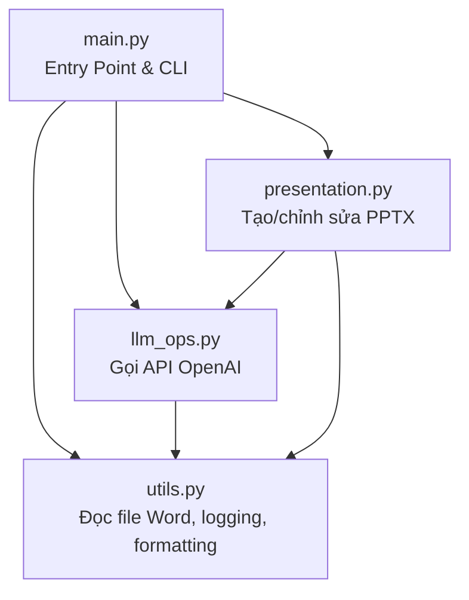
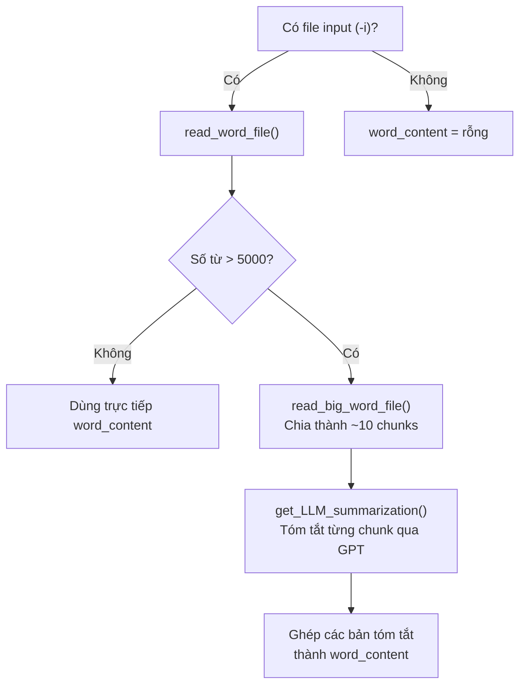
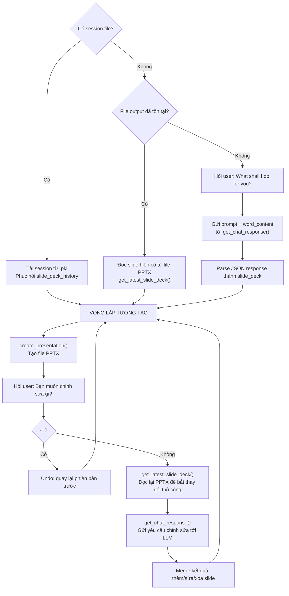

# Phân tích luồng hoạt động dự án odin-slides

## Tổng quan

**odin-slides** là một công cụ CLI bằng Python, sử dụng **OpenAI GPT-3.5 Turbo** để tự động tạo bài trình chiếu PowerPoint (`.pptx`) từ tài liệu Word (`.docx`) hoặc từ prompt của người dùng.

## Kiến trúc Module



| Module | Chức năng chính |
|--------|----------------|
| `odin_slides/main.py` | Entry point, parse CLI args, đọc/tóm tắt tài liệu Word |
| `odin_slides/llm_ops.py` | Gọi OpenAI API để tóm tắt nội dung và sinh nội dung slide |
| `odin_slides/presentation.py` | Tạo/cập nhật file PPTX, quản lý vòng lặp tương tác với user |
| `odin_slides/utils.py` | Đọc file `.docx`, format log/message, trích xuất JSON |

---

## Luồng hoạt động chi tiết

### Bước 1: Khởi chạy CLI (`main.py:13-33`)

```bash
odin-slides -t <template.pptx> -o <output_name> [-i <input.docx>] [-s <session.pkl>]
```

| Tham số | Bắt buộc | Mô tả |
|---------|----------|-------|
| `-t` | ✅ | File PPTX làm template (lấy layout/theme) |
| `-o` | ✅ | Tên file output (không cần extension) |
| `-i` | ❌ | File Word đầu vào để tạo slide |
| `-s` | ❌ | File session `.pkl` để phục hồi phiên làm việc |

---

### Bước 2: Xử lý tài liệu đầu vào (`main.py:46-71`)



- **Tài liệu nhỏ** (≤ 5000 từ): đọc trực tiếp toàn bộ nội dung
- **Tài liệu lớn** (> 5000 từ): chia thành ~10 phần, mỗi phần được gửi tới GPT để tóm tắt, sau đó ghép lại

---

### Bước 3: Tạo nội dung slide bằng LLM (`presentation.py:224-351`)

Hàm `build_slides_with_llm()` là **trung tâm** của luồng xử lý:



> **Lưu ý quan trọng:**
> Dự án hỗ trợ **chỉnh sửa thủ công** file PPTX: sau mỗi vòng lặp, tool sẽ đọc lại file PPTX để phát hiện các thay đổi do user tự sửa bằng PowerPoint.

---

### Bước 4: Gọi OpenAI API (`llm_ops.py`)

Có **2 hàm chính**:

#### `get_LLM_summarization()` — Tóm tắt tài liệu
- Model: `gpt-3.5-turbo`
- Prompt: yêu cầu rút gọn bài viết, giữ nguyên các điểm chính
- Dùng ở Bước 2 khi tài liệu > 5000 từ

#### `get_chat_response()` — Sinh/sửa nội dung slide
- Model: `gpt-3.5-turbo`
- System prompt quy định format JSON response:
  ```json
  [{"slide_number": 1.0, "title": "...", "content": "...", "narration": "..."}]
  ```
- Quy tắc đặc biệt:
  - **Thêm slide**: dùng slide_number thập phân (2.1, 2.2...)
  - **Xóa slide**: đặt slide_number thành số âm
  - **Sửa slide**: giữ nguyên slide_number

---

### Bước 5: Tạo file PPTX (`presentation.py:104-166`)

Hàm `create_presentation()`:
1. Load template PPTX → lấy layout "Title and Content"
2. Xóa tất cả slide cũ trong template
3. Với mỗi slide trong `slide_deck`:
   - Tạo slide mới với layout từ template
   - Đặt **title** và **content** vào placeholder
   - Đặt **narration** vào phần Notes
4. Lưu file → mở file (nếu OS hỗ trợ)

---

### Bước 6: Quản lý Session (`presentation.py:337-350`)

- Khi kết thúc (hoặc lỗi/Ctrl+C), session được lưu vào file `.pkl`
- Session chứa: `slide_deck_history` (lịch sử undo) + `word_content`
- Có thể phục hồi bằng tham số `-s`

---

## Logic merge slide (`presentation.py:296-332`)

Khi LLM trả về kết quả chỉnh sửa:

1. Slide có cùng `slide_number` → **thay thế** bằng phiên bản mới
2. Slide có `slide_number` âm → **xóa** slide tương ứng
3. Slide có `slide_number` thập phân (vd: 2.1) → **chèn** vào giữa
4. Sắp xếp lại theo `slide_number` → đánh số lại từ 1

---

## Tóm tắt luồng end-to-end

```
User chạy CLI
    ↓
Đọc file Word (nếu có) → tóm tắt nếu > 5000 từ
    ↓
User nhập prompt đầu tiên → GPT sinh slide dạng JSON
    ↓
Tạo file PPTX từ template + nội dung slide
    ↓
╔══════════════════════════════════════╗
║  VÒNG LẶP:                          ║
║  1. Hiển thị PPTX cho user xem      ║
║  2. User nhập yêu cầu chỉnh sửa    ║
║  3. Đọc lại PPTX (phát hiện sửa    ║
║     thủ công)                        ║
║  4. GPT xử lý → merge kết quả      ║
║  5. Tạo lại PPTX                    ║
║  (Nhập -1 để undo)                  ║
╚══════════════════════════════════════╝
    ↓
Ctrl+C hoặc lỗi → Lưu session (.pkl)
```
